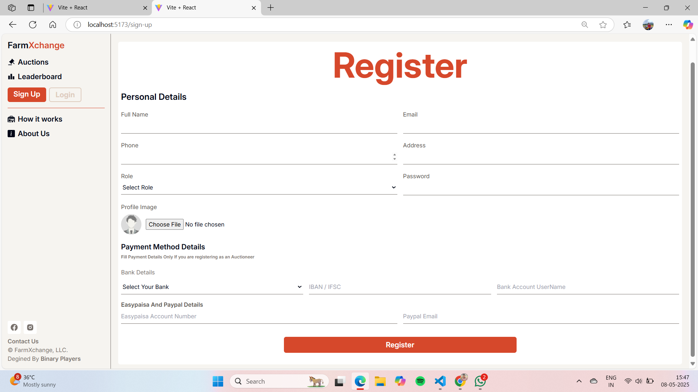

# Auction Platform for Farmers 🧑‍🌾📈

This MERN stack-based platform empowers farmers by providing stable market access through real-time auction listings, transparent bidding, and secure transactions.

---

## 🔥 Features
- Farmer and Buyer Authentication
- Real-Time Auction Listings
- Secure Bidding System
- Dashboard for Auction Management

---

## 📸 Screenshots

### 1. Home Page

> A user-friendly homepage where users can view ongoing auctions.

### 2. Auction Listings Page

> Browse live auctions and place bids in real-time.

### 3. Buyers Leaderboard

> View top buyers ranked by their participation and winning bids.

### 4. New Registration Page

> Register as a farmer, buyer, or auctioneer.

### 5. Login Page

> Secure login interface for all users.

### 6. How It Works

> Step-by-step guide to using the auction platform effectively.

### 7. About Us Page

> Learn more about the team and mission behind the platform.

### 8. Auctioneer Home Page

> Personalized homepage for auctioneers to manage their listings.

### 9. Upload Payment Proof

> Buyers can upload transaction receipts for verification.

### 10. Create Auction

> Auctioneers and farmers can list new items for bidding.

### 11. User Profile Page

> View and update user account information.

### 12. Admin Dashboard

> Full administrative control panel for managing the platform.

### 13. Delete Items (Admin)

> Admin can remove inappropriate or expired auction listings.

### 14. User Dashboard (Admin View)

> Overview of registered users from an admin perspective.

---

## 🚀 Tech Stack
- **Frontend:** React.js, TailwindCSS
- **Backend:** Node.js, Express.js
- **Database:** MongoDB

---

